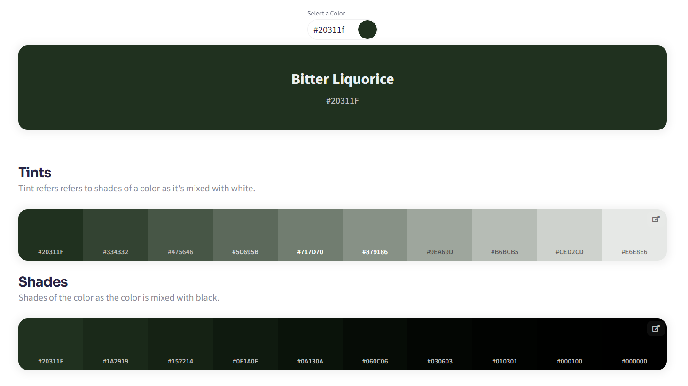
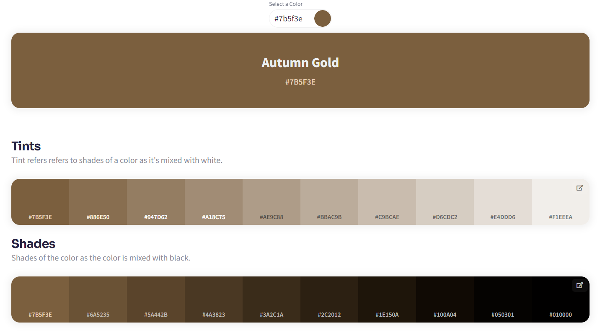

# Theming

This folder goes over the riders-link application colors

## Tools

- [ColorKit Shades Generator](https://colorkit.co/color-shades-generator/20311f/)

  - Useful for generating shades and tints from a key color

- [React Native Paper Theme Generator](https://callstack.github.io/react-native-paper/docs/guides/theming/#creating-dynamic-theme-colors)
  - Creates a Material Design 3 theme object for you based off primary, secondary, and tertiary key colors

## Colors

### Primary Color

### Secondary Color

